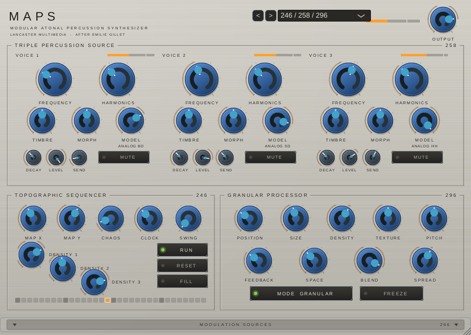
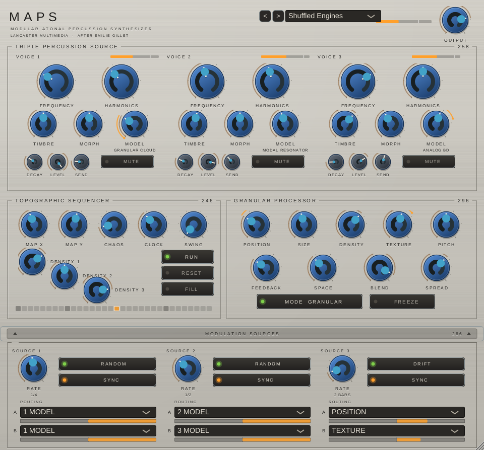

# MAPS

**M**odular **A**tonal **P**ercussion **S**ynthesizer — a drum machine with no
drum samples in it.

Mutable Instruments **Grids** drives three **Plaits** voices restricted to the
eight non-pitched engines, each with a send into a **Clouds** granular
processor. The routing is fixed and every control is on the panel: no menus,
no shift key, no paging.



AU, VST3 and a standalone app, for macOS, Windows and Linux.

## What it is

One instrument hard-wiring a signal chain that normally takes five modules and
a fistful of cables:

- **246 · Topographic Sequencer** — Grids. An X/Y map of drum patterns with a
  chaos control and independent density per part. Follows your host's tempo
  when the transport is rolling and free-runs on the CLOCK knob when it is not.
- **258 · Triple Percussion Source** — three Plaits voices, MODEL stepping
  through granular cloud, filtered noise, particle noise, inharmonic string,
  modal resonator, and the analogue bass drum, snare and hi-hat. The pitched
  engines are deliberately absent.
- **296 · Granular Processor** — Clouds on a send bus, with Supercell's
  vocabulary: the five primaries plus FEEDBACK, SPACE, BLEND and SPREAD, which
  the original module hides.

The model numbers are real 200-series Buchla numbers whose jobs rhyme with
these. So is the rest of the panel language.

## The modulation sources

Three LFOs fold out of the bottom of the panel. Each has a waveform, a rate,
a sync switch, and two routes — a destination and a bipolar attenuator.



**A synced LFO does not free-run and catch up. It reads its phase from the
host's position in quarter notes**, so it is exactly on the grid, it is right
again the instant you locate or loop, and the same bar of your timeline gives
the same result every pass. The RANDOM waveform is a sample-and-hold whose
value is a hash of which cycle you are in rather than a running dice roll —
which is what makes "a different engine every beat" a part you can keep rather
than a thing that happened once.

**MODEL is the destination this section was built for.** Point a synced RANDOM
source at a voice's MODEL and it picks a different engine every beat; point a
RAMP UP at it over two bars and it walks the whole bank. MODEL is latched at
the moment a voice fires, never mid-tail, so the engine changes cleanly on the
attack instead of clicking under a ringing drum. The presets **Shuffled
Engines** and **Engine Ramp** are there to be listened to first.

Two things worth knowing about depth. A route at full depth swings half the
parameter's range each way, which is the attenuverter convention — so a knob
parked at one end will not reach the other. And routes sum, so pointing both
of one source's routes at the same destination at full depth gives the whole
range: that is how a single LFO reaches all eight engines rather than four.

## Playing it

It runs on its own. Drop it on an instrument track, press play, and Grids
starts. MAP X and MAP Y walk the pattern space; CHAOS loosens it; the three
DENSITY knobs on the descending diagonal decide how busy each part is.

It also takes MIDI, alongside the sequencer rather than instead of it. General
MIDI drum notes work as you would expect — 36 kick, 38 snare, 42 hat — so an
existing pattern in the timeline plays something sensible with no remapping.
Velocity becomes the accent.

**A note about DENSITY in the granular section.** Clouds treats it as a meta
parameter and it has a genuine dead zone: at exactly the middle, grain overlap
is zero and nothing comes out. The knob's taper is skewed so that region sits
low and is quick to cross, but if the cloud ever goes quiet, that is the first
knob to look at.

## Building it

You need CMake, Git, and a C++ toolchain: Xcode command line tools on macOS,
Visual Studio with the Desktop C++ workload on Windows, the usual JUCE dev
packages on Linux.

```bash
cmake --preset macos        # or windows / linux
cmake --build --preset macos
ctest --preset macos
```

The first configure downloads JUCE (about 100 MB). On macOS a successful build
installs the AU and VST3 into `~/Library/Audio/Plug-Ins/`; Logic caches its AU
scan, so quit and reopen it after the first install.

`ctest` runs the audio engine's own test suite — about five seconds, no audio
hardware needed. If that is green the DSP is sound and anything else is a host
problem.

## How it is put together

```
maps-core/     the instrument, in plain C++. No JUCE. No libDaisy.
maps-plugin/   the framework wrapper: parameters, state, MIDI, the panel
```

`maps-core` is the whole of what makes a sound, and it has no framework
dependency of any kind — that is what lets the same engine run on a Daisy
Seed3 in a sealed box later without the two versions drifting apart. See
`CLAUDE.md` for the architecture and for the mistakes already made.

## Credit and licence

**Plaits, Clouds and Grids were designed by Émilie Gillet.** MAPS rearranges
her work into one instrument; the interesting parts are hers. Her firmware is
MIT licensed and is vendored under `maps-core/vendor/` with the notices intact
and every local modification listed in `vendor/ATTRIBUTION.md`. Nothing is
taken from VCV Audible Instruments or Cardinal, both GPL-3 forks of the same
code, so the vendored tree carries no copyleft obligation of its own.

- <https://github.com/pichenettes/eurorack>
- <https://github.com/pichenettes/stmlib>

MAPS itself is **AGPL-3.0-or-later**, because that is JUCE 8's open-source
licence — JUCE 6 and 7 offered GPLv3, JUCE 8 does not. `NOTICE.md` explains
which layer is under what, and why `maps-core` is deliberately free of both
JUCE and the VST3 SDK.
